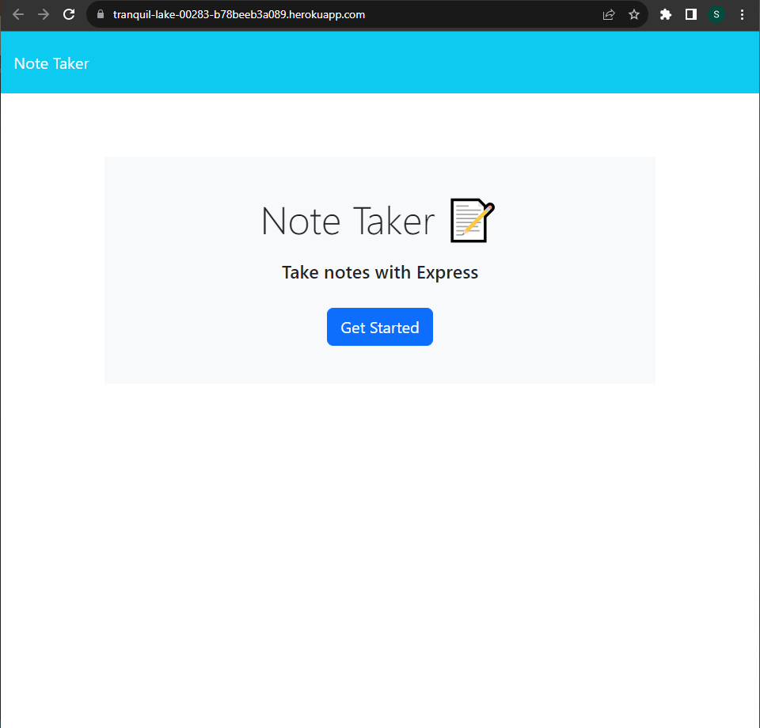
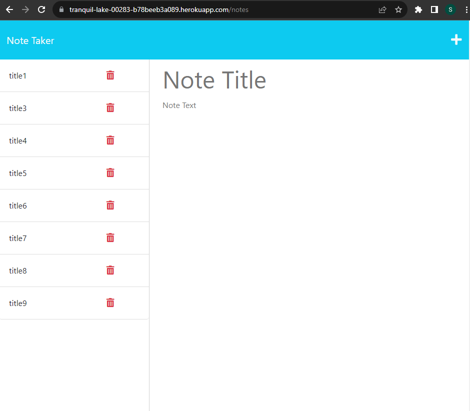

# note-taker

## Table of Contents

[Description](#description)

[Installation](#installation)

[Usage](#usage)

[Images](#images)

[URLs](#urls)

## Description

This is a simple note taker which can easily save and delete personal notes.

## Installation

If cloned from GitHub, run npm install on the cloned repo. After, run node server.js to launch the server for the application. Then open localhost:3001 in the browser to view the webpage.

## Usage

Using the note taker is intuitive and straightforward. Click the Get Started button to access the note taker. Then the note information can be entered in the form boxes. To save a note, there is a save icon in the top right corner. To delete a note, click the trash icon beside it in the list on the left.

## Images

This is an image of the home page:

This is an image of the notes page after addin several notes:

## URLs

GitHub Repository: https://github.com/Shippo704/note-taker

Deployed Heroku App: https://tranquil-lake-00283-b78beeb3a089.herokuapp.com/